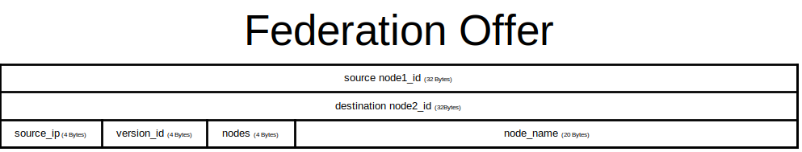
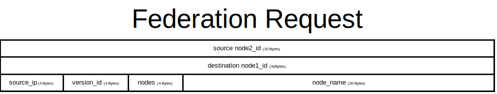
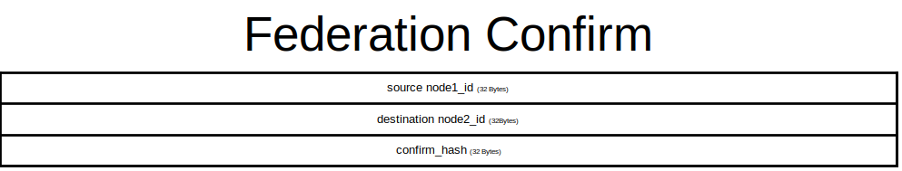
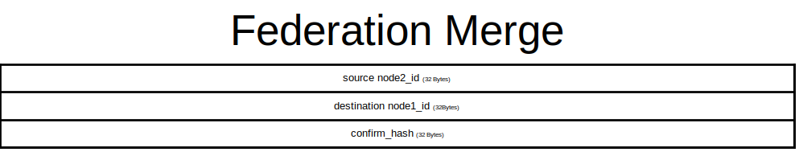

# DistXchange
## What is DistXchange?
DistXchange is the programmer of a list of self-written protocols for distributed data exchange.
## Concept
## Protocols
- [ ] DCS (= Distributed Content Sharing) ` Port:20020 `
- [ ] DCC (= Distributed Crypto Currency) ` Port:20021 `
- [ ] DAS (= Distributed Account System) ` Port:20022 `
- [ ] DRS (= Distributed Relay System) ` Port:20023 `
- [ ] DUS (= Distributed Update System) ` Port:20024 `
### DRS - Distributed Relay System
#### DRS Federation Offer

Node1 send a Federation Offer message to the relay of Node2
#### DRS Federation Request

Node2 responds with a Node Federation Request if it wants to enter a federation
#### DRS Federation Confirm

If Node1 is satisfied with Node2, it sends a Federation Confirm message
#### DRS Federation Merge

Finally, Node2 confirms the federation and connects with a Federation Merge with Node1
### DCS - Distributed Content Sharing
Soon
### DAS - Distributed Account System
Soon
### DCC - Distributed Crypto Currency
Soon
### DUS - Distributed Update System
Soon